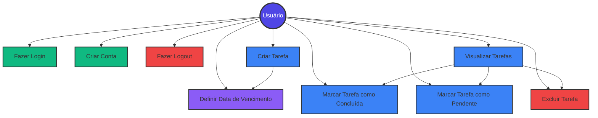
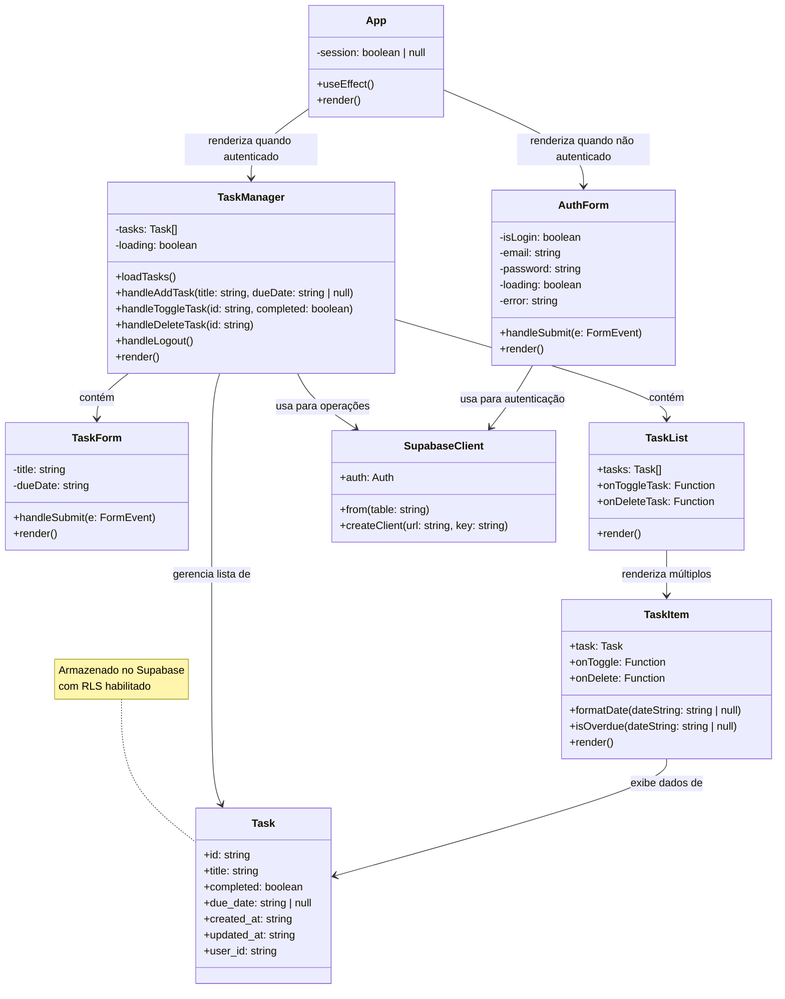

# Gerenciador de Tarefas

Um sistema completo de gerenciamento de tarefas desenvolvido com React, TypeScript, Tailwind CSS e Supabase.

## 📋 Características

- 🔐 Autenticação de usuários (login/registro)
- ✅ Criar, visualizar, editar e excluir tarefas
- 📅 Definir datas e horários de vencimento
- ⏰ Indicação visual de tarefas atrasadas
- 🎨 Interface moderna e responsiva
- 🔒 Segurança com Row Level Security (RLS)

## 🚀 Como Executar a Aplicação

### Pré-requisitos

- Node.js (versão 18 ou superior)
- npm ou yarn
- Conta no Supabase

### Configuração do Supabase

1. Crie uma conta em [supabase.com](https://supabase.com)
2. Crie um novo projeto
3. Execute a migration SQL localizada em `supabase/migrations/20251109222331_create_tasks_table.sql`
4. Copie as credenciais do projeto (URL e Anon Key)

### Instalação

1. Clone o repositório:
```bash
git clone <seu-repositorio>
cd gerenciadorDeTarefas
```

2. Instale as dependências:
```bash
npm install
```

3. Crie um arquivo `.env` na raiz do projeto:
```env
VITE_SUPABASE_URL=sua_url_do_supabase
VITE_SUPABASE_ANON_KEY=sua_chave_anonima
```

4. Execute o projeto em modo de desenvolvimento:
```bash
npm run dev
```

5. Acesse a aplicação em `http://localhost:5173`

### Scripts Disponíveis

- `npm run dev` - Inicia o servidor de desenvolvimento
- `npm run build` - Cria a build de produção
- `npm run preview` - Visualiza a build de produção
- `npm run lint` - Executa o linter
- `npm run typecheck` - Verifica os tipos TypeScript

## 📊 Diagrama de Caso de Uso



## 🏗️ Diagrama de Classe



## 🗃️ Estrutura do Banco de Dados

```sql
tasks
├── id (uuid, PK)
├── title (text, NOT NULL)
├── completed (boolean, default: false)
├── due_date (timestamptz, nullable)
├── created_at (timestamptz, default: now())
├── updated_at (timestamptz, default: now())
└── user_id (uuid, FK -> auth.users)
```

## 🛡️ Segurança

O projeto implementa Row Level Security (RLS) no Supabase para garantir que:
- Usuários só podem visualizar suas próprias tarefas
- Usuários só podem criar tarefas para si mesmos
- Usuários só podem atualizar suas próprias tarefas
- Usuários só podem excluir suas próprias tarefas

## 🎨 Tecnologias Utilizadas

- **React 18** - Biblioteca JavaScript para interfaces
- **TypeScript** - Superset tipado do JavaScript
- **Vite** - Build tool e dev server
- **Tailwind CSS** - Framework CSS utility-first
- **Supabase** - Backend as a Service (autenticação e banco de dados)
- **Lucide React** - Biblioteca de ícones
- **ESLint** - Linter para qualidade de código

## 📝 Licença

Este projeto é de código aberto e está disponível sob a licença MIT.
